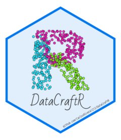
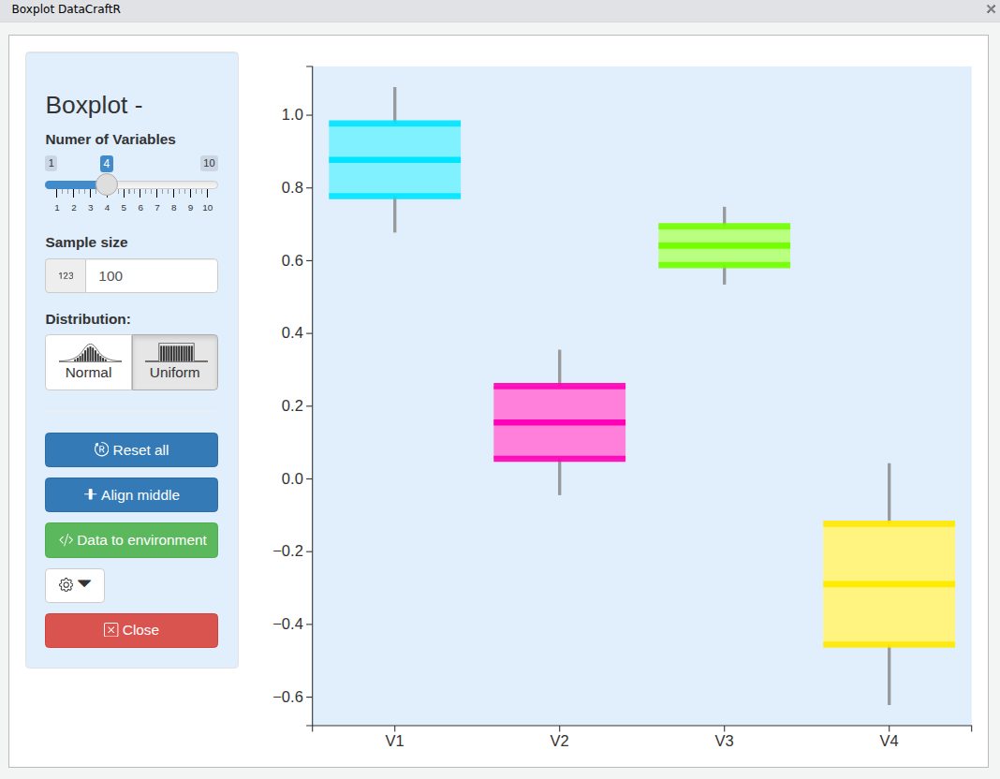

# DataCraftR 

**DataCraftR** is an R package that provides a set of interactive tools for **data generation through visualization**.  
Each tool is implemented as a **Shiny addin** integrating **D3.js** for real-time, graphical data creation.

> **Developed with**: Human Coding
> **Inspried on**: [drawdata.xyz](https://github.com/koaning/drawdata)
> **Powered by**: [Shiny](https://shiny.posit.co/) and [D3](https://d3js.org/)

---

## Overview

DataCraftR allows users to _draw_ or _manipulate_ visual representations of data (boxplots, histograms, scatterplots) and automatically generate the corresponding datasets in R.

This package is ideal for teaching, demonstrations, or prototyping datasets based on distributional intuition.

---

## Features

- Interactive **Boxplot**: drag quantiles to define distributions.
- Interactive **Histogram**: draw bar heights to define data frequency.
- Interactive **Scatter **: paint clusters or point groups directly.
- One-click export of generated data to RDS temporal file.
- Designed as RStudio **Addins** for quick access.
- Built with **Shiny** and **D3.js** for modern, responsive UI.

---

## Installation

```r
# From GitHub
# (requires the 'remotes' package)
install.packages("remotes")
remotes::install_github("CarlosRivera1212/DataCraftR")
```

---

## Usage

Each visualization tool can be launched directly from R or from the RStudio Addins menu.

```r
# Boxplot generator
DataCraftR::boxplot_dcr()

# Histogram generator
DataCraftR::histogram_dcr()

# Scatter plot generator
DataCraftR::scatter_dcr()
```

Each tool opens a Shiny gadget with an interactive D3.js visualization.  
The generated data can be exported to temporal RDS file by clicking **“Save Data”**.

---

## Technical Notes

- The package integrates **Shiny**, **bslib**, **shinyWidgets**, and **D3.js**.
- Custom JavaScript files are located in `inst/assets/js/` and are loaded dynamically by each addin.
- All visualizations communicate with R using Shiny’s `sendCustomMessage` and input bindings.

---

## Example Screenshots

#### Screenshot of Scatterplot example



#### Screenshot of Boxplot example



#### Screenshot of Histogram example


---

## Author

**Carlos Rivera**

---

## License

This package is licensed under the **GPL-3.0 License**.
See the `LICENSE` file for more details.

---

## Citation

If you use this package in academic work, please cite it as:

> Rivera, C. (2025). _DataCraftR: Interactive Data Generation Tools with Shiny and D3.js._
> GitHub repository: [https://github.com/CarlosRivera1212/DataCraftR](https://github.com/CarlosRivera1212/DataCraftR)

---

## Future Directions

- [c] count
- [d] Extend interactivity to line-based density multicategory data.
- [t] tail
- [f] density 2D
- [p] Extend interactivity to proportion bars multicategory data.
- [t] Extend interactivity to tabular proportions data.
- [l] Extend interactivity to line-based temporal data.
- [r] radial
- Integrate export options to CSV or RDS directly from the UI.
